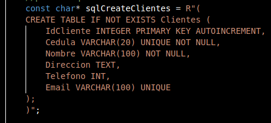

# ie0217-proyecto

## Requisitos funcionales de la base de datos
Ya que el cliente debe elegir entre las modalidades de atención al cliente o información sobre préstamos, hay que definir qué funciones tiene cada modalidad. A continuación se especifican los tipos de cuentas bancarias que los clientes pueden tener, así como la gestión de información sobre préstamos.
### Definición de operaciones bancarias para atención al cliente

El cliente será capaz de crear hasta dos cuentas de ahorro, donde cada una puede ser en dólares o colones. Las operaciones para esta modalidad son las siguientes:
- **Depósitos a la cuenta del cliente:** El cliente será capaz de abonar dinero a su(s) cuenta(s).
- **Retiros de la cuenta del cliente:** El cliente será capaz de retirar dinero desde una o ambas de sus cuentas.
- **Transferencia entre cuentas:** Un cliente será capaz de transferir dinero a la cuenta de otro cliente distinto.
- **Pago de servicios:** El cliente será capaz de realizar un pago para servicios básicos, como agua, luz o internet, cuyos montos estarán predefinidos.
- **Compra de CDP:** Cada cliente será capaz de realizar la compra de un Certificado de Depósito a Plazo (CDP), donde será capaz de elegir el plazo de tiempo en meses. También el cliente será informado de la tasa de interés correspondiente.
- **Tipo de cambio:** El cliente será capaz de revisar el tipo de cambio entre dólares y colones, el cual será un valor predefinido.
- **Bloqueo y desbloqueo de cuentas:** Cada cliente será capaz de bloquear su cuenta en caso de que sospeche fraude o robo, de manera que no se permitirán depósitos o retiros de la cuenta hasta que el cliente la desbloquee.
- **Ver registro de transacciones:** Cada cliente será capaz de revisar el registro de las transacciones realizadas desde su cuenta, como pagos, depósitos, retiros, etc.

### Gestión de Préstamos
Ahora bien, a continuación se describen las funciones del módulo referente a todo lo que tiene que ver con los préstamos bancarios:
**Tipos de Préstamos:** El sistema debe ofrecer opciones de préstamos, incluyendo:
- **Préstamos Personales:** Para uso general, con tasas de interés fijas.
- **Préstamos Hipotecarios:** A largo plazo, destinado a la compra de propiedades, con opciones de pago a plazos largos y tasas fijas.
- **Préstamos Prendarios:** Producto de financiación para la adquisición de bienes muebles registrables. Tiene una tasa de interés fija.

Ahora bien, para pagar los préstamos deben haber distintas **opciones de pago** para los clientes. A continuación se documentan configuraciones posibles para ver que el cliente se informe y poder pagar su préstamo: 
- **Frecuencia de Pago:** Opciones de pago mensual, trimestral, o anual, dependiendo de cuántos meses quiere pagar el cliente.
- **Cuotas y Desglose:** Cada cuota debe desglosarse en capital e interés para que el cliente vea cuánto se destina a la deuda principal y a intereses. Esta información se le desplegará al cliente en formato tabular.
- **Actualización del Saldo de Préstamo:** Cada pago debe reflejarse en el saldo del préstamo, actualizándose de acuerdo con el monto pagado.

También hay que definir el **Pago y Cálculo de Intereses**, lo cual es información importante para el cliente que consulta: 
- **Cálculo de Intereses:** Basado en el saldo pendiente, tasa de interés y período de tiempo restante. Con esta opción el cliente será capaz de ver cuánto deberá pagar en intereses.
- **Método de Pago:** Ya que el cobro del préstamo será mensual, el cliente será capaz de abonar una cantidad a su elección, de manera que puede pagar varios meses en una sola transacción, si así lo desea. Tras cada pago, el sistema actualizará el monto debido por el cliente.

Otras opciones importantes para la gestión de préstamos se detallan a continuación:
- **Ver tabla sobre información del préstamo:** Opción para que el cliente pueda revisar la información referente al préstamo que tenga, donde la información será desplegada en formato tabular. Esta opción va de la mano con la opción de **cuotas y desglose**. El cliente podrá ver los pagos restantes del préstamo, el interés que posee dicho préstamo, las cuotas restantes y las cuotas pagadas.
- **Préstamos en dólares o colones:** Esta opción permitirá al cliente realizar préstamos en el tipo de moneda deseado entre dólares y colones. Asimismo, el cliente podrá ver la tasa de interés, el plazo en meses y cuota mensual referente a su préstamo, lo cuál se manejará en la opción de **ver tabla sobre información del préstamo**.
 

### Identificación y Seguridad del Cliente
Ya que estamos trabajando con un sistema bancario, es necesario tomar en cuenta la importancia de la seguridad de los datos del cliente. Para esto, se definen el siguiente **método de autenticación** 
- **Nombre de Usuario y Contraseña:** Esquema básico para el manejo personal de una cuenta por cliente, el cual puede incluir requisitos de complejidad para la contraseña, como el uso de mayúsculas o carácteres numéricos. Es un método sencillo pero robusto, utilizado por los bancos estatales costarricenses, y apto para la inclusión en el código sin necesidad de utilizar aplicaciones terceras. Para mayor seguridad, la contraseña se guardará como un hash, y cada cliente será asignado un número del 0 al 999,999,999; donde dicho número para representar a los clientes se manejará internamente en el programa. Se utilizará la función hash _SHA-256_.


## Base de datos
### Razones para utilizar SQLite
Para la implementación de la base de datos de este sistema bancario se va utilizar el motor SQLite, esto debido a su ligereza y agilidad en operaciones de lectura y escritura, lo que lo hace una adecuada opción para contextos donde se necesite un movimiento de datos instantáneo como es el caso de un sistema bancario.

Además de esto, es un motor ofrece las características que se le conocen como ACID (atomicity, consistency, isolation, durability), lo que significa que este motor asegura que todas o ninguna operación dentro de una transacción se va realizar (no deja una transacción a medias), además de que cada transacción va a ser independiente de las demás, por lo que no van a afectar a otras operaciones; y por ultimo, que las operaciones realizadas no podrán deshacerse, evitando de esta forma errores o estados incompletos.

Por otro lado, SQLite ofrece compatibilidad con múltiples plataformas y distintos lenguages de programación, lo que hace posible poder integrarlo a entornos diferentes y a distintas tecnologías como lo puede ser aplicaciones móviles, web etc. Esta flexibilidad lo hace excelente para temas de un código escalable, ya que garantiza una fácil adaptación para futuras mejoras, actualizaciones, mantenimiento etc. 

SQLite también es compatible con extensiones que permiten seguridad para la integridad de la base datos como cifradores o gestores de claves, además de poder ofrecer mecanismos de control de acceso. Extensiones como SQLCypher son compatibles con SQLite el cual proporciona cifrados avanzados a la base de datos bajo algoritmos, lo que asegura que los datos permanezcan seguros frente a accesos no autorizados.


### Estructura de la Base de datos.
Para la estructura de la base de datos a realizar, se proponen 5 tablas: Clientes, Cuentas, Préstamos, CDP y transacciones.

* Clientes: Almacena la información básica de cada cliente
  * IdCliente (PK) INT AUTO_AUTOINCREMENT,
  * Cédula VARCHAR() UNIQUE NOT NULL,
  * Nombre  VARCHAR() NOT NULL,
  * Dirección TEXT, 
  * Teléfono INT, 
  * email  VARCHAR() UNIQUE,

* Cuentas: Cuentas bancarias asociadas a los clientes
  * IdCuenta (PK) INT AUTO_AUTOINCREMENT,
  * IdCliente (FK) INT NOT NULL, 
  * Tipo ENUM (colones, dólares) NOT NULL, .
  * Saldo DECIMAL() DEFAULT 0.00,

* Cuentas: Almacena información de las cuentas bancarias asociadas a los clientes
  * IdCuenta (PK) INT AUTO_AUTOINCREMENT,

* Créditos: Almacena información de los créditos asociados a los clientes
  * IdPréstamo (PK) INT AUTO_AUTOINCREMENT, 
  * IdCliente (FK) INT NOT NULL,
  * Monto DECIMAL() NOT NULL, 
  * Interés DECIMAL() NOT NULL, (porcentaje)
  * Plazo INT NOT NULL, (en meses)
  * CuotaMensual DECIMAL() NOT NULL, 
  * Tipo ENUM (Hipotecario, Personal, Prendario) NOT NULL, 

* CDP: Almacena Información de los certificados de depósito a plazo de los clientes
  * IdCDP (PK) INT AUTO_INCREMENNT,
  * IdCliente (FK) INT NOT NULL, 
  * Monto DECIMAL() NOT NULL, 
  * TazaInterés DECIMAL() NOT NULL, (porcentaje)
  * Plazo INT NOT NULL, (en meses)
  * FechaInicio DATE NOT NULL,

* Transacciones: Funciona como registro de las transacciones realizadas a las cuentas.
  * IdTransacción (PK) INT AUTO_INCREMENT,
  * IdCliente (FK) INT NOT NULL,
  * Tipo ENUM (Deposito, Retiro, Transferencia, Abono) NOT NULL, 
  * Fecha TIMESTAMP DEFAULT CURRENT_TIMESTAMP,

### Seguridad de la Base de Datos
Para la integridad de los datos finacieros de los clientes se propone lo siguiente

 * Cifrado de la base de datos, es posible con extensiones a SQLite como SQLCypher, el cual con algoritos de cifrado, garantiza que la información no va ser legible cin las claves correspondientes.

 * Controles de acceso robustos, con permisos estrictos a los directorios, limitando el poder de escribir, leer o ejectur solo para usuarios autorizados.

 * Utilización de archivos journal, implementados en SQLite, los cuales son archivos temporales, los cuales funcionan como respaldo en el caso de que una transacción no se complete adecuadamente, permitiendo revertir los datos si se corrompen o debido a cualquier eventualidad.

 * Protección contra inyecciones SQL, haciendo un código SQL robusto con sentencias preparadas para evitar inyecciones SQL, evitando que las lineas ingresadas por personas malintencionadas se puedan interpretar como código SQL

### Generación de reportes de préstamos
Para generar reportes bancarios es necesario poder implementar el código, para el cual se utilizará el lenguaje C++, de manera que este se conecte de manera adecuada a la base de datos, donde están almacenados los registros.
El código recolecta por parte del usuario en la interfaz el número de ID del préstamo del cual se quiere generar el reporte. Una vez corroborado de que el ID del préstamo es existente, por medio de consultas SQL recolecta información de la base de datos, por medio de funciones se calculan las cuotas pagadas, el aporta al capital y los intereses pagados, por medio de extensiones o librerías como csv.h o libharu.h es posible presentar estos datos en formato CSV o PDF, por último se pueden almacenar estos reportes en directorios específicos.

### Automatización de pruebas
Para esto se pueden utilizar librerías como el framework de pruebas Google Test (gtest/gtest.h) en C++ para desarrollar pruebas automatizadas que validan las distintas funciones del sistema.
Entonces, luego de esta implementación, es necesario hacer distintas pruebas a las funciones del sistema para verificar su correcto funcionamiento. A continuación se tiene un ejemplo de cómo se vería una prueba para la función de depositar utilizando el framework de Google Test:\

```cpp
#include 1gtest/gtest.h1
#include 1mi_sistema_bancario.h1

// Prueba para la función de depósito
TEST(SistemaBancarioTest, DepositoIncrementaSaldo) {
    Cuenta cuenta;
    cuenta.depositar(100); // Depositar 100
    EXPECT_EQ(cuenta.getSaldo(), 100); // Verificar que el saldo sea 100
}
```

A continuación se listan los tipos de pruebas que serán necesarios:

**Pruebas de Integración con la Base de Datos:** 
- **Validación de Consultas SQL:** Verificar que las consultas SQL devuelvan resultados correctos para operaciones de préstamo. 
- **Pruebas de Conexión y Desconexión:** Confirmar que el sistema se conecte y desconecte de SQLite correctamente.

**Pruebas de Funcionalidades Clave:**  
- **Pruebas de Transacciones:** Validar depósitos, retiros, transferencias y pagos de servicios, asegurando que se registren en la base de datos. 
- **Pruebas de Seguridad y Autenticación:** Asegurar que solo usuarios autorizados puedan acceder mediante usuario y contraseña.

**Pruebas de Rendimiento:** 
- **Simulación de múltiples usuarios y transacciones simultáneas:** Asegurar que el sistema gestione cargas sin errores. 
- **Evaluación de respuesta ante grandes volúmenes de datos:** Identificar posibles cuellos de botella en la base de datos.

**Pruebas de Generación de Reportes:** 
- **Verificación de la Exactitud del Reporte:** Asegurar que los reportes generen la información correcta, con desglose de pagos en formato tabular.
- **Confirmación de Almacenamiento y Descarga:** Verificar que los reportes se almacenen correctamente y se puedan descargar en los formatos especificados.

**Pruebas de Frontera:** 
- **Saldo justo y operaciones límite:** Verifica el comportamiento del sistema al realizar transacciones con el saldo exacto o en el límite permitido. 
- **Máximos y mínimos de transacciones:** Asegura que el sistema maneje correctamente montos extremos dentro de los límites definidos.

**Pruebas de Error de Entrada:**  
- **ID de préstamo no existente:** Valida que el sistema maneje adecuadamente intentos de acceso a préstamos que no existen. 
- **Montos negativos y caracteres no válidos:** Prueba el sistema con datos no válidos en campos numéricos y verifica el manejo de errores.

**Pruebas de Manejo de Errores de Conexión:** 
- **Desconexión inesperada:** Simula la pérdida de conexión durante una transacción para asegurar que el sistema mantenga la integridad de los datos. 
- **Reintentos de conexión y consistencia:** Verifica que el sistema reintente la conexión sin corrupción de datos tras una reconexión exitosa.

**Pruebas de Persistencia de Datos:** 
- **Validación de datos tras reinicio:** Asegura que los datos ingresados se mantengan intactos en la base de datos luego de reiniciar el sistema. 
- **Verificación de integridad tras operaciones sucesivas:** Confirma que transacciones consecutivas se reflejen correctamente en la base de datos.

**Pruebas de Concurrencia:** 
- **Operaciones simultáneas en múltiples cuentas:** Prueba la base de datos con varias transacciones en paralelo para verificar la gestión de concurrencia. 
- **Prevención de condiciones de carrera:** Asegura que no haya conflictos al acceder a datos compartidos por varias operaciones.

**Pruebas de Funcionalidad de Reportes para Distintas Condiciones:** 
- **Reporte sin transacciones:** Verifica que el sistema genere un reporte adecuado aun cuando no haya transacciones registradas. 
- **Reporte con cuotas pagadas y parciales:** Asegura que el desglose de cuotas en el reporte refleje correctamente los pagos realizados, pendientes y acumulados.

Al realizar todas estas pruebas se podrá validar el correcto funcionamiento del sistema. Sin embargo, cabe destacar que no todas las pruebas son fácilmente automatizables, como la prueba de frontera o error de entrada, pero se intentará automatizar todas las que sean posibles.

# Diseño de los menús a implementar
Para facilidad del uso del sistema, se implementarán 3 menús: uno principal para elegir el módulo (atención a cliente o gestión de préstamos), y luego un menú correspondiente para cada módulo.


La información referente a cada opción del menú corresponde a la discutida en la sección de requisitos funcionales del sistema. Estos tres menús deberían cumplir con todas las características requeridas para el correcto funcionamiento del sistema, de manera que el usuario podrá elegir entre las opciones correspondientes para cada menú, o bien usar una opción de salir para volver al menú principal. 

# Cronograma de Proyecto

## Fechas Importantes
- **Propuesta**: <span style="color:green">25 October 2024</span>  
- **Avance**: <span style="color:green">8 November 2024</span>  
- **Final**: <span style="color:green">26 November 2024</span>  

## Actividades

| **Periodo** | **Fecha**              | **Christian Tareas**                | **Diego Tareas**                 |
|-------------|------------------------|-------------------------------------|----------------------------------|
| Periodo 1   | 26 - 27 Oct            | [  Investigación sobre base de datos, la conexión de este con el código implementado en C++, temas de seguridad con respecto a esta base de datos y la estructura que debe tener. Investigación sobre la generación de reportes y automatización de pruebas]                                 | [ Investigación sobre la experiencia del usuario y sobre el funcionamiento de los opciones que ofrece este sistema bancario para la personalización de cuotas, tasas montos etc. También parte de la investigación sobre la automatización de pruebas]                              |
| **Entrega** | <span style="color:green">25 Oct</span> | [ ] Revisión y Entrega              | [ ] Revisión y Entrega            |
| Periodo 2   | 28 Oct - 3 Nov         | [ Implementación de la base de datos en SQLite]                                 | [ Implementación de las funciones del sistema]                              |
| Periodo 3   | 4 - 7 Nov              | [ Seguir con el trabajo asignado ]                                 | [ Seguir con el trabajo asignado ]                              |
| **Entrega** | <span style="color:green">8 Nov</span> | [ ] Revisión y Entrega              | [ ] Revisión y Entrega            |
| Periodo 4   | 9 - 10 Nov             | [ Implementación del código de C++ a la base de datos ]                                 | [ Implementación de pruebas automáticas ]                              |
| Periodo 5   | 11 - 17 Nov            | [ Seguir con el trabajo asignado ]                                 | [ Seguir con el trabajo asignado ]                              |
| Periodo 6   | 18 - 24 Nov            | [ Verificar el correcto funcionamiento del sistema con todas las implementaciones ]                                 | [ Verificar el funcionamiento del sistema con todas las implementaciones ]                              |                       |
| **Entrega** | <span style="color:green">26 Nov</span> | [ ] Revisión y Entrega              | [ ] Revisión y Entrega            |


## Bitáora del primer avance

* Para este avance se tienen listos por completo los 3 menús principales, el menú de módulos y los 2 submenús de atención al cliente y de gestión de préstamos, el menú de módulos se maneja en el main.cpp y los submenús al ser más extensos se manejan por aparte por con los archivos menu.hpp y menu.cpp, de tal forma se tiene un código más ordenado y modulado.

#### Menú de módulos


#### Menú de Atención al cliente


#### Menú de gestión de préstamos


Estos menús funcionan con un bucle do-while, por lo que si no se se ingresa un numero de las opciones el menú se vuelve a ejecutar, para manerar entradas inválidas, se agrego el siguiente bucle para asegurarse que el menú solo pueda recibir números enteros.

#### Manejo de entradas inválidas para los menús


Para la base datos , como ya se determinó se está utilizando Sqlite, para manejar la conexión con la base de datos, se implementó una clase llamada Database, por medio de esta con sus objetos, atributos y métodos se van a realizar casi todas las operaciones del programa, por medio de lectura y modificiones sobre estos datos.

#### Declaración de la clase Database


Como se ve, se definen el objeto db que es un puntero para establecer conexión con la base de datos más adelante, conectarDB() y cerrarDB() Tablas creadas
rarDB() métodos para conectarse y cerrar la BD, estos 3 como miembros privados.

Como públicos se tienen todos los métodos necesarios para realizar las operaciones de los menús de antencion al cliente y gestión de préstamos.


* En Database.cpp:

 Se hace la implementanción de funcion ejecutarSQL() la cual con ayuda de funciones importadas de la biblioteca SQLite usa las sentencias SQL y las ejecutas sobre la base de datos, en este caso se usa para crear las tablas, en otros fracmentos del código sqlite3_exec no va ser útil porque se van útilizar sentencias preparadas, en este caso la sentencias para las tablas son fijas.

 Se establecen punteros que almacenan las sentencias SQL para crear las 5 tablas necesarias en este proyecto, estos mismos luego se pasan a la función para crear las tablas.
 
 #### Sentencia SQL para crear la tabla clientes, para las otras tablas es la misma lógica, este puntero se le pasa a la función ejecutarSQL() para crearla
 

 #### Tablas creadas
 

 #### Funciones implementadas para este avance

Además de la implementación de la base de datos, también se escribe el código para todas las funciones referentes a la parte de atención al cliente del proyecto.
- **realizarDeposito**
- **realizarRetiro**
- **realizarTransferencia**
- **realizarPagoServicios**
- **comprarCDP**
- **bloquearCuenta**
- **desbloquearCuenta**
- **verRegistroTransacciones**

##### Operaciones Bancarias:

**Depositar y Retirar Fondos:**  Funciones que permiten realizar depósitos y retiros en cuentas de clientes, verificando el saldo cuando es necesario. Aún falta por implementar la generación del registro de la transferencia.

**Transferencias entre Cuentas:** Permite transferir fondos entre cuentas de diferentes clientes, verificando que la cuenta de origen tenga fondos suficientes. Necesita un poco más de trabajo ya que llama a las funciones de retiro y depósito, y estas requieren un poco más de trabajo.

**Compra de CDP:** Función para crear certificados de depósito a plazo con tasa de interés y plazo predefinidos. Aún queda por definir los valores finales para los certificados.

**Bloqueo y Desbloqueo de Cuentas:** Funcionalidades para marcar una cuenta como bloqueada o desbloqueada, utilizando un campo adicional en la base de datos. Esta función está lista.

**Consulta de Tipo de Cambio:** Consulta que muestra un tipo de cambio fijo simulado (en este avance). Aún falta por definir el valor a utilizar para el tipo de cambio.

**Registro de Transacciones:** Visualización completa del historial de transacciones realizadas en el sistema, incluyendo el tipo, monto y fecha de cada transacción. A pesar de que aún las funciones anteriores no generan un reporte, se sabe dónde estará guardada la información, por lo que esta función debería estar lista.

## Bitáora de la etapa final

Para este avance se implementó el resto del código, todas las funcionalidades del programa se implementaron como métodos dentro de la clase Database(), sin importar si estos interactúan con la base de datos como tal, se hizo de esta manera ya que los métodos que no trabajan con la base de datos son pocos, y por orden se implementaron junto a los que si dentro de esta clase.

Para la implementación del código en este avance se modificaron ligeramente las tablas, para la tabla créditos se la añadio apartados para almacenar la frecuencia de pagos, el numero de cuotas pagadas y el tipo de moneda en la cual se gestiona el crédito, para la tabla de Transacciones se le añadió el monto de la Transaccion y  la fecha, por último a la tabla de cuenta se la añadió un apartado binario (0-1) para el estado de la cuenta entre bloqueada o desbloqueada.

También se decidió eliminar el método desbloquearCuenta(), ya que esta funcionalidad la absorbió el método bloquearCuenta(), el cual se encargar de tanto hacer el bloqueo o el desbloqueo, dependiendo del estado de la cuenta en cuestión al momento de llamar al método.

El código se organizó y se dividió en 2 carpetas principales, /include donde se incluyen los archivos de encabezado, donde se declaran las funciones para el menú y la declaración de la class de la cual gira todo el código. En la carpeta /src se incluyen todos los archivos de implementación (.cpp). De esta forma tenemos un código mas ordenado y organizado, lo cual lo hace más cómodo para trabajarlo y darle mantenimiento.

* src/Database.cpp: este archivo se establece el constructor de Database, el cual llama a la función para conectarse a la base de datos banco.db, si la conexión es exitosa, ejecuta las sentencias SQL para crear las tablas. Estas sentencias preparadas son establecidas en este mismo archivo como punteros que contienen la cadena de caracteres con la sentencia. Por lo que este archivo inicializa la conexión con la base de datos y crea las tablas.

* src/ menú.cpp: en este archivo se implementean los menús declarados en menu.hpp, el menú de atención al cliente, el menú de gestión de préstamo y el submenú de préstamos que se despliega en la primera opción del menú de gestión de préstamo. Estos menús funcionan con un bucle do-while y manejan entradas invalidas con un bucle if-continue y con cin.fail(), permitiendo solo ingresar enteros.

* src/ AtencionCliente.cpp: Se implementan los métodos correspondientes al menú  de atención al cliente, los cuales en su mayoría interactúan con la base de datos, todas esta funciónes se apoyan de la API de sqlite3.
Se establece la funcion conectarDB(),tambien el destructor de la clase Database(), el cual cierra la conexión.

Los métodos realizarDeposito(), realizarRetiro(), realizarTranferencia(),comprarCDP(), y bloquearCuenta() funcionan con sentencias SQl, con spaceHolders(?), es decir son sentencias SQl incompletas que esperan datos, en este caso a que el usuario los ingrese, de tal forma con apoyo de la API de sqlite3, se prepara la sentencia con los datos ingresados y se ejecutan las consultas, de esta forma interactuando con la base de datos.

El método realizarTransferencia() invoca a los métodos de retiro y de deposito, de tal forma el saldo que se suma en la cuenta destino se resta en la de origen.
De manera similar el método de realizarPagoServicios(), pimero con un bulce do-while, permite elegir entre distintos tipos de servicios a pagar, este invoca a realizarTransferencia() para hacer el pago entre la cuenta de origen y la cuenta de servicios.

Para el método consultarTipoCambio(), simplemente imprime la linea de código con la información respectiva.

Los métodos de depósito, retiro y transferencia, de igual manera con sentencias SQl y spaceholders registran las transacciones en la tabla correspondiente.

El método de verRegistroTransacciones(), con una sentencia preparada extrae la información de la tabla Transacciones y la imprime en pantalla.

* src/ GestionPrestamos.cpp: esta es el encargado de los métodos del menú de gestión de préstamos.
El método consultarTiposPrestamos(), invoca a la función SubMenuTipoPrestamos(), la cual despliega un menú para que el usuario navegue entre los distintos tipos de préstamos y muestra la información ateniente.

Método consultarFrecuenciaPagos(), consulta sobre el ID del préstamo el cual se quiere consultar y por medio de consulta SQL extra la información necesaria y la muestra en pantalla.

Método calcularIntereses(), primero despliega un menú para elegir entre el calculo de intereses para prestamos y de CDP, de igual manera extrae con consultas SQL la informacion necesaria de las tablas y hace los calculos, los cuales los muestra en pantalla al usuario.

Método mostrarCuotasYDesglose(), siguiendo la misma lógica, extrae la información de las tablas con consultas SQL y las muestra en pantalla.

Método mostrarMetodosPago(), simplemente muestra una salida con esta información con cout

Y el método, verInformacionPrestamo(), de igual manera con sentencia SQL preparada, hace la consulta para extraer la informacion y la muestra en pantalla.

* src/ main.cpp: este archivo simplemente despliega el menú principal, inicia el flujo de todo el código

